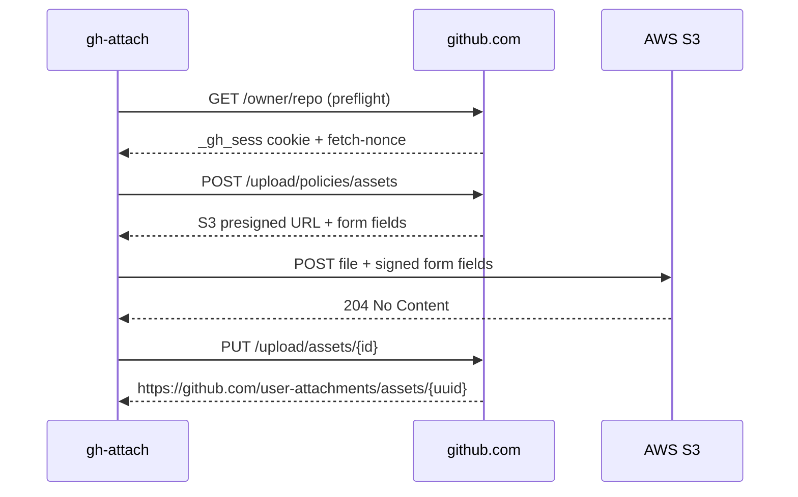

# gh-issue-attachments

Upload images, videos, and files to GitHub issues from the command line. No public API exists for this — this tool reverse-engineers the browser's 3-step S3 presigned URL flow.



## Install

```bash
gh auth status                          # must be authenticated
git clone https://github.com/bc/gh-issue-attachments.git
cd gh-issue-attachments
uv sync
./setup.sh && source .env              # opens browser for GitHub login, saves cookie
```

## Usage

```bash
uv run gh-attach screenshot.png --repo owner/repo              # get URL
uv run gh-attach diagram.png --repo owner/repo --issue 42      # comment on issue
uv run gh-attach photo.jpg --repo owner/repo --issue-body 42   # append to issue body
```

Supports PNG, JPG, GIF, SVG, MP4, MOV, ZIP, PDF — anything GitHub's web UI accepts.

## Claude Code plugin

```
/plugin install https://github.com/bc/gh-issue-attachments
```

Adds a **lab-notebook** skill. Invoke it directly or mention it inline:

```
/lab-notebook debug the flaky auth test in CI
```

> use the lab-notebook skill to investigate why the deploy is slow

Creates a GitHub issue, works on the task, attaches screenshots and notes as comments along the way, then opens the finished issue in your browser.

## License

MIT
